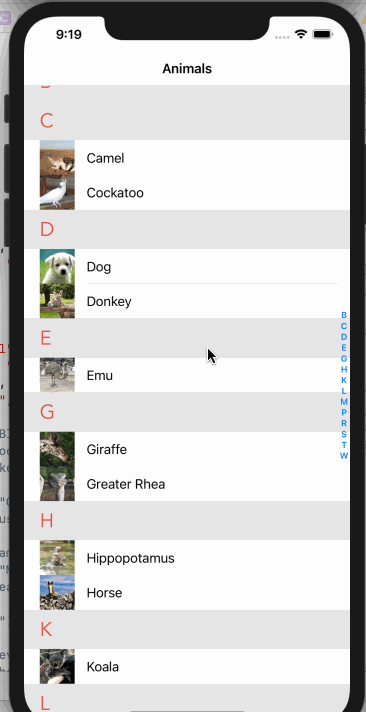
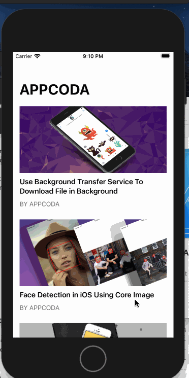

# My Swift-Learing Project

## 00 - [SearchFlickrPhotos]

第一頁
- 第一個是搜尋文字的輸入匡(Text)
- 第二個是每頁要呈現的數量的輸入匡(Per Page)
- 此兩個輸入匡都要填寫,button 才可以點擊
- 不可點擊的 button 和可點擊的 button 用不同顏色區別
- 點擊button會轉跳(push)到第二頁(搜尋結果頁)

第二頁 (搜尋結果頁)
- 顯示Flickr回傳的API結果,
- Cell 會顯示圖片(photo),與標題,Cell為正方形

  

## 01 - [AdaptiveUI]

- 主要使⽤ Storyboard 來進⾏使⽤者介⾯元件的佈局，不需要撰寫程式碼，
建⽴⼀個具有單⼀視圖控制器（view controller），可以適應多種螢幕尺⼨以及⽅向的
App。

  

## 02 - [IndexedTable]
表格視圖製作索引列表
- 可以在標準表格視圖中顯⽰⼀系列的動物清單
- 除了列出所有動物外，這個 App 將動物群組起來至不同區塊，並顯⽰⼀個可以快速存取的索引列表。

  

## 03 - [TableCellAnimation]
為表格視圖 cell 加入簡單的淡入動畫讓 App 更⽣動活潑
- 淡入動畫
- 使用 CATransform3D 建立旋轉特效
- 使用 CATransform3DTranslate 建立飛入特效

  

## 04 - [KivaLoan]
呼叫Kiva API 來取得最近的融資貸款，並以表格視圖來做呈現

- 建⽴ JSON 資料模型
- 使⽤ Kiva API 取得貸款資料
- 使用 Codable 來解碼 JSON
- 在表格視圖顯示貸款資料

  

## 05 - [EmailAttachment]
- 以內建的API，在App中整合email編輯器，撰寫⼀個簡單的 App 來⽰範如何傳送
email 與如何加入 email 附加檔案。

  

## 06 - [SocialSharing]
- 使⽤者滑動⼀個 cell 並且按下分享（ Share） 按鈕，整合Facebook所提供的SDK，使App可以在刊登訊息在 Facebook動態牆和現實動態，實作分享功能。

  

## 07 - [SMSDemo]
- 使⽤ MessageUI 框架進⾏簡訊（SMS）與媒體簡訊（MMS）傳送

  

## 08 - [MapKitDirection]
使⽤ MKDirections API，依照你預設的交通型態，取得駕駛與步⾏⽅向。 MKDirections 也會另外提供替代道路資訊。
- 取得⽬前使⽤者的位置
- 計算路徑並將它畫在地圖上
- 使⽤分段控制
- 取得路徑步驟並顯⽰開⾞/步⾏路徑的導引

  

## 09 - [LocalSearch]
MKLocalSearch API 可以讓使用者搜尋同性質的地方，並且在
地圖上呈現。並且可以執⾏位置的搜尋，可以是名字、地址、或者
類型，例如咖啡或比薩。

  

## 10 - [RecordPro]
使用 AV Foundation 框架中的兩個類別，製作一個錄音加上播放的APP。
- AVAudioPlayer – 把它想成是⼀個⾳訊播放器，⽤來播放聲⾳檔。
- AVAudioRecorder – ⼀個錄製⾳訊的⾳訊錄製器

  

## 11 - [QRCodeReader]
使用 AVFoundation 框架，偵測 QR Code 並進行資訊解碼，運用URL Scheme連結網站。

  

## 12 - [SimpleCamera]
使⽤ AVFoundation 框架來擷取靜態圖像
- 使⽤ AVFoundation 框架來建⽴相機介⾯
- 使⽤前鏡頭與後鏡頭相機來擷取靜態圖像
- iOS 13 App 程式設計進階攻略 | AppCoda出版 211
- 使⽤⼿勢辨識器來偵測滑動（swipe）⼿勢
- 為相機 App 加入縮放功能
- 儲存圖⽚至照⽚膠卷

  

## 13 - [SimpleVideoCam]
使⽤ AVFoundation 框架，經由變更 AVCaptureSession 的輸入與輸出,錄製影片並用 AVKit 播放影音檔。

  

## 14 - [GoogleAdDemo]
使⽤Google AdMob來播放橫幅廣告
-使用 CocoaPods 安裝 Google Mobile Ads SDK 製作表格視圖標題顯示橫幅廣告與播放插播廣告。

## 15 - [CustomFont]
使用程式自訂字型，可以再設定中調整字體大小

  

## 16 - [AirDropDemo]
使⽤ UIActivityViewController 透過 AirDrop 來分享圖片與檔案。
資料型態包括 
- String 
- UIImage 
- URL

  

## 17 - [CollectionViewDemo]
建⽴⼀個簡單的 App，以網格佈局⽅式來顯⽰圖⽰集
- 使⽤ UICollectionView 來建構⼀個簡單的網格佈局
- 集合視圖 Cell 背景的客製化

  

## 18 - [CollectionViewDemo2]

- 按下圖⽰時，App 會帶出⼀個強制回應（Modal）視圖，並將圖⽰以較
⼤的尺⼨來顯⽰。
- 使⽤者可以選擇多張圖⽰，並使⽤動態視圖控制器來進⾏分享。

  

## 19 - [DoodleFun]
使用 UICollectionView 製作一個簡單且具有畫面自適應的商品清單。

  

## 20 - [SidebarMenu]
應⽤ SWRevealViewController 建⽴⼀個滑動導覽選單
- 按下了導覽列上左上角的選單按鈕後，觸發了選單
- ⼿指向內容區右邊滑動來帶出選單
- 選單出現後，使⽤者可以再次按下左上角的選單按鈕關掉它
- 可在內容區上，往左拖曳來關掉選單

  

## 21 - [NavTransition]
視圖控制器轉場以及動畫

  

## 22 - [SlideDownMenu]
實作下拉式的選單以及動畫。

  

## 23 - [SelfSizingCell]
Cell 尺⼨⾃適應與動態型態
- 針對 Prototype cell 定義 Auto Layout 約束條件
- 指定表格視圖的 estimatedRowHeight 屬性
- 設定表格視圖的 rowHeight 屬性為 UITableViewAutomaticDimensio
- 可在設定中調整字體大小

  

## 24 - [SimpleRSSReader]
XML 解析、 RSS與表格視圖 Cell 的展開
- 使用 XMLParser 解析讀取 XML 檔 製作一個 RSS 閱讀器應用，與製作表格視圖 Cell 的展開。

  

## 25 - [VisualEffect]
使⽤ UIVisualEffect 來產⽣模糊背景
- 了解 UIVisualEffect 與 UIVisualEffectView

  
